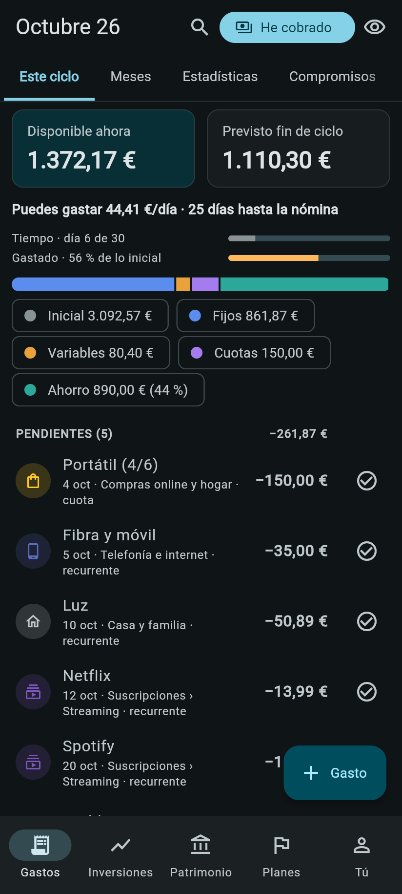
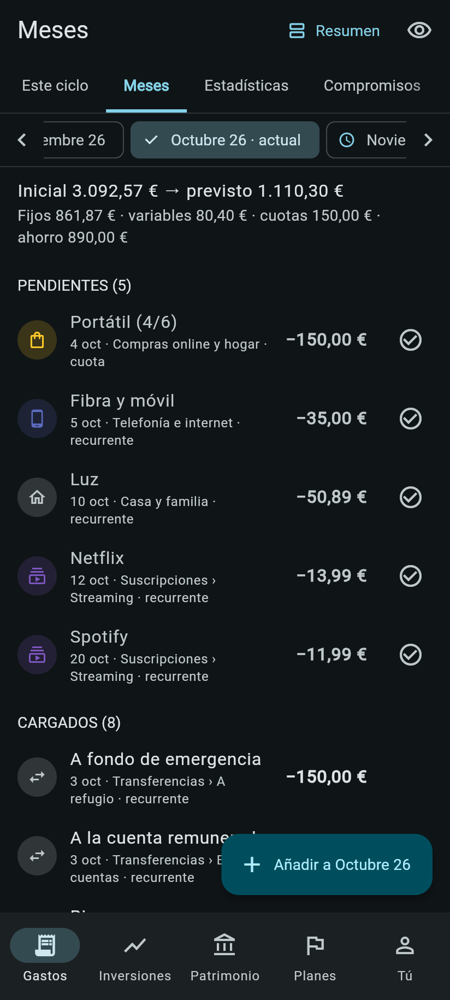
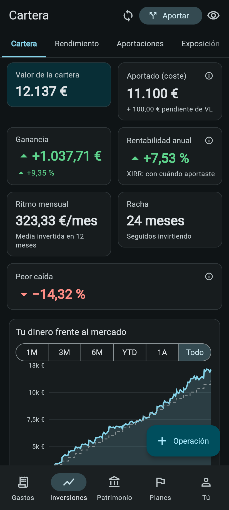
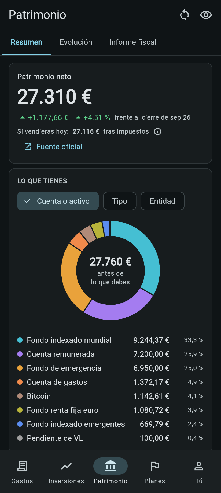
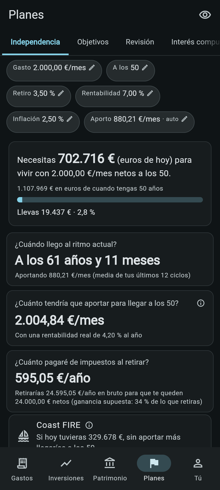

# Fanal

**Self-hosted personal finance: paycheck budgeting, an investment portfolio with allocation
targets, net worth, Spanish taxes and a FIRE planner. One Flutter codebase for Android and web,
with a FastAPI + PostgreSQL backend.**

I built Fanal to replace the two spreadsheets I used to run my money with, and I use it every day.
The UI is in Spanish (es-ES, `1.234,56 €`), the tax rules are Spanish, and the data model is
multi-user. All the data you see below is from a demo user generated by `backend/app/demo.py`.

<p align="center">
  
  
  
  
  
</p>

## The problem it solves

Most budgeting apps think in calendar months and most portfolio trackers stop at "how much is it
worth today". Running your own finances with a monthly salary and a long-term investment plan
needs both, joined up:

- **Your month starts on payday, not on the 1st.** What you can really spend is what's left until
  the next salary, after the bills and instalments that are still to come. Fanal works in pay
  cycles and tells you how much you can spend per day.
- **Spreadsheets break.** Formulas get overwritten, bank exports have to be pasted by hand and
  nothing checks that the numbers add up. Fanal imports bank and broker files without duplicates,
  closes each cycle against the real bank balance and keeps an audit trail.
- **"Am I on track?" needs taxes and time.** It's not enough to know the portfolio value: you need
  the real return, what you'd pay in tax if you sold, how far you are from financial independence
  and what changes if you save a bit more. Fanal calculates all of that with your own data.
- **Your financial data stays yours.** It's self-hosted: no third-party aggregator, no bank
  credentials, no ads. You run your own instance.

## What it does

- **Expenses by pay cycle, not by calendar month.** A cycle runs from one payday to the next. It
  shows what's available now, the projected balance at the end of the cycle and how much you can
  spend per day.
  - Recurring charges, card instalment plans, shared expenses and loans.
  - A forward view of the next 12 months, where single occurrences can be planned, moved or
    skipped.
  - When the real bank balance doesn't match, the cycle closes with an explicit adjustment.
- **Investments.** Positions are rebuilt from transactions, with average cost and FIFO lots side
  by side.
  - Fund-to-fund transfers keep their tax lots, as Spanish *traspasos* require.
  - Allocation targets per asset class and per asset, with ranges.
  - A contribution engine that only buys: it fills gaps in a cascade and rounds by largest
    remainder, so the orders always add up to the cent.
- **Prices.** Pulled automatically with fallbacks: FT → quefondos → Yahoo for funds, CoinGecko →
  Kraken for crypto.
  - Price jumps that look implausible are rejected.
  - A weekly job backfills price history.
- **Analytics.** Daily-linked time-weighted return, XIRR, maximum drawdown and volatility.
  - Net-worth history.
  - Look-through exposure of funds by region and sector.
- **Taxes.** Spanish income tax (state and regional brackets, personal allowances, the separate
  savings base) and wealth tax.
  - The brackets are **data, not code**: a `tax_parameters` table by year and region, with the
    official source for every row.
  - A yearly report lists realised gains (FIFO), interest and year-end balances.
- **FIRE planner.** How much you need, at what age you get there at your current pace, and the
  monthly contribution needed to hit a target age.
  - Includes the tax due on withdrawals, a bridge to a public pension and Coast FIRE.
  - A Monte Carlo simulation (2,000 lives, seeded) gives the probability that the money lasts.
  - A side-by-side "what if" comparison.
- **Importers.** All imports have a preview and are idempotent; any batch can be undone.
  - Bank statements in CSV or XLSX: Spanish column names are detected and lines are matched to
    planned movements.
  - Broker and exchange exports (CSV) and PDF account statements.
  - On Android, a file can be shared into the app from any other app.
- **Everyday details.**
  - Offline capture: expenses get a client-side UUIDv7 and are queued, so a retry never
    duplicates.
  - A privacy mode that hides every amount.
  - Local notifications on Android.
  - Full export to JSON or Excel.

Fanal shows calculations and assumptions. It never gives financial advice.

## Engineering notes

- **No floats for money, anywhere.**
  - `NUMERIC` in Postgres, `Decimal` in Python, `Decimal` in Dart, and strings in JSON.
  - The Dart client is generated from the OpenAPI schema with a decimal → `String` type mapping.
  - CI fails if a `double` shows up in the generated models.
- **Financial logic is pure functions** in `backend/app/domain/`: portfolio replay, allocation,
  performance, tax, FIRE, Monte Carlo and pay cycles. Each has acceptance tests with hand-checked
  numbers.
- **Isolation by user.** Every table carries `user_id`, every query filters by the token's user,
  and a test checks that one user can't read another's data. The app drops all cached data when
  the session user changes.
- **Auth.**
  - Password + TOTP 2FA, with recovery codes.
  - Rotating refresh tokens: in an HttpOnly cookie on the web, in secure storage behind a
    biometric unlock on Android.
  - Rate limiting backed by the database.
- **Accessibility.** Every screen is built from shared components (a test forbids loose fields
  and styles), works from 390 px to 1920 px, and the whole widget test suite also runs with the
  system text at 130 %.
- **Tests.** About 190 backend tests (pytest, against a real Postgres) and 88 Flutter tests,
  including golden tests for the charts. CI runs them all on every push.

## Stack

| | |
|---|---|
| Backend | Python 3.13, FastAPI, SQLAlchemy 2, Alembic, Pydantic v2, APScheduler worker, uv |
| Database | PostgreSQL 18 |
| App | Flutter (Android + web), Riverpod 3, go_router, fl_chart, generated `dio` client |
| Tooling | Docker Compose for local development, GitHub Actions for CI |

## Running it locally

Requirements: Docker (with Compose) for the backend, and the Flutter SDK for the app. Everything
runs on your machine; nothing connects to an external server except the public price sources.

```bash
# API + database + worker (http://localhost:8100/api, docs at /api/docs)
docker compose -f infra/compose.yaml up -d

# Demo user with a year of made-up data (demo@faro.example / demo-faro-2026)
docker compose -f infra/compose.yaml exec api python -m app.demo --reset

# Web app against the local API (2FA is disabled in the dev compose file)
cd app && flutter run -d chrome --dart-define=API_ORIGIN=http://localhost:8100
```

To build the Android app against your own instance:

```bash
cd app && flutter build apk --dart-define=API_ORIGIN=https://your-own-host
```

This repository only includes the local development setup. If you host your own instance, keep
the API behind HTTPS and never expose the database to the internet.

To run the tests:

```bash
docker compose -f infra/compose.yaml run --rm --no-deps api pytest
cd app && flutter test
cd app && flutter test --dart-define=FARO_TEXT_SCALE=1.3   # same suite with large system text
```

To regenerate the screenshots, build the web app, serve it on port 5050 and run
`python scripts/screenshots.py --out docs/screenshots` (needs Playwright).

## Layout

```
backend/app/domain/      pure financial logic (portfolio, allocation, performance, tax, FIRE…)
backend/app/services/    use cases on top of the database
backend/app/importers/   bank, broker and spreadsheet importers
backend/app/api/         FastAPI routers
backend/alembic/         migrations (tax parameters are seeded here, with sources)
app/lib/features/        Flutter screens: expenses, investments, net worth, plans
app/packages/faro_api/   Dart client generated from the OpenAPI schema
infra/                   Docker Compose for local development
```

---

Built with Claude Code as a pair programmer. The product, the design decisions, the reviews and
the testing are mine.

## License

**Personal, non-commercial use only.** You can read, run and modify Fanal for yourself. You may
not use it, or anything derived from it, for any commercial or economic purpose: selling it,
offering it as a service to others, using it to provide financial services, or building it into
anything that makes money. See [LICENSE](LICENSE) for the full terms.

Fanal is not financial advice. © 2026 Adrián López.
